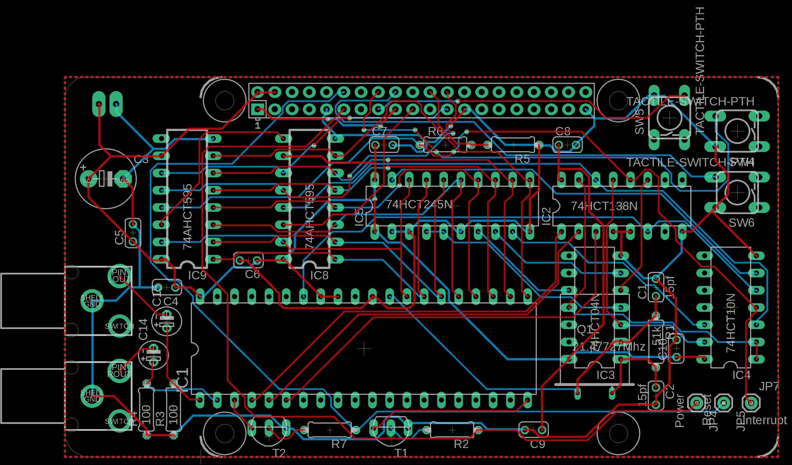

# nes-forever
A Raspberry Pi Hat for controlling the NES sound hardware directly

A work in progress of a circuit that keeps an NES chip in an infinite loop, constantly playing any note data that is shifted into the input registers.

